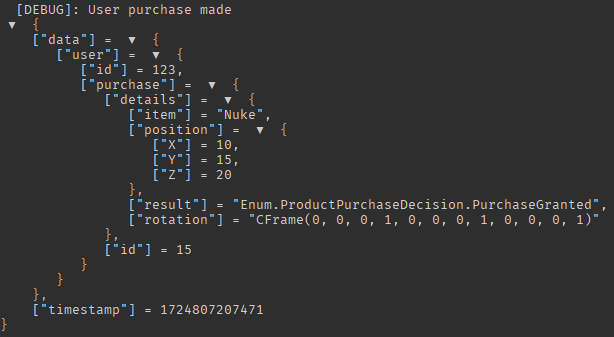

<h1 align="center">
 <br>
 <br>

 <br>
 <br>
 <br>
</h1>

> Context based Server-Side logging solution for ROBLOX projects.


---

<br>

## Demo

```ts
import { rLog } from "@rbxts/rlog";

const logger = new rLog();

logger.debug("User purchase made", {
  user: {
    id: 123,
    purchase: {
      id: 15,
      details: {
        item: "Nuke",
        result: Enum.ProductPurchaseDecision.PurchaseGranted,
        position: new Vector3(10, 15, 20),
        rotation: new CFrame(),
      },
    },
  },
});
```



## Installation

Install rLog with your preferred package manager.

### npm

```sh
npm install @rbxts/rlog
```

### pnpm

```sh
pnpm add @rbxts/rlog
```

### yarn

```sh
yarn add @rbxts/rlog
```

### Wally

```toml
[dependencies]
Reflex = "daymxn/rlog@1.0.0"
```

## Overview

rLog is a context based server-side logging framework for ROBLOX, designed to help organize and structure your logging process.

Utilizing [Correlation IDs](https://microsoft.github.io/code-with-engineering-playbook/observability/correlation-id/) via rLog's `LogContext`, you can create logging infrastructure that mirrors more entrprise-like systems; faciliating easier debugging and external auditing.

## Documentation

[Quick Start](https://rlog.daymxn.com/docs/quick-start)

[API Reference](https://rlog.daymxn.com/docs/api)

[Fast Breakdown](https://rlog.daymxn.com/docs/fast-breakdown)

[Basic Guides](https://rlog.daymxn.com/docs/category/guides)

[Advanced Guides](https://rlog.daymxn.com/docs/category/advanced-guides)

## Features

### Basic Logging

- Log data to the console according under different severity levels.
- Utilize tags (or prefixes) for individual logging instances.

### Serialization

- Attach data to your log entries that gets serialized before being sent; ensuring the data is properly visable.
- Support for deeply nested roblox data-types that don't typically translate well (eg; CFrames).
- Support for encoding custom classes and functions.
- Customizable class serialization.

### Log Context

- Attach [Correlation IDs](https://microsoft.github.io/code-with-engineering-playbook/observability/correlation-id/) to your logs, creating a linkage between logs in individual flows.
- Differiate between multiple of the same log in the same function.
- Automatically generate unique IDs when needed.
- Optionally configure a custom method for providing your own ID generation.
- Share configuration settings between context consumers, optionally unique to each invocation.
- Optionally "suspend" logs until they're needed (ie; a `WARNING` or `ERROR` occurs.); facilitating verbose logs for easier debugging without taking up resources until they're needed.

### Source Context

- Attach data to your logs to identify which *file* the log was sent from.
- Attach data to your logs to identify what *line number* in the file the log was sent from.
- Attach data to your logs to identify which *function* the log was sent from, or optionally the *nearest* named function on the stack (in the case of anonymous functions)
- In the case of anonymous functions, identify the nearest *named* function from where the log was sent.

### Sinks

> [!TIP]
> **rLog** provides an in-house sink for sending logs to the [Google Cloud Logging](https://cloud.google.com/logging) platform.
>
> Learn more about it by giving the [Using rLog with Google Cloud Logging](http://localhost:3000/rlog/docs/advanced/google-cloud-logging) guide a read!

- Define callbacks that can conditionally decide to filter logs from reaching any output.
- Define callbacks that can send logs to external services for storage and auditing.
- Recursively define callbacks through a heirachy of logger instances and configurations; allowing you to provide callbacks for individual flows.
- Define dynamic callbacks that change according to arguments (eg; the player).

### Enrichers

- Define callbacks that can conditionally mutate or add data to logs.
- Recursively define callbacks through a heirachy of logger instances and configurations; allowing you to provide callbacks for individual flows.
- Define dynamic callbacks that change according to arguments (eg; the type of data being sent).

### Configuration

- Extensive configuration options for toggling various serialization settings, and overriding encoding behavior when needed.
- Optionally configure the minimum log level that gets output to the console.
- Optionally provide custom methods for formatting data in the roblox console, or directing how it reaches the console.

## Getting Started

So you're ready to get started with **rLog**!

You can either checkout our [Quick Start](https://rlog.daymxn.com/docs/quick-start) guide, read through our list of [Basic Guides](https://rlog.daymxn.com/docs/category/guides), or jump straight into our [API Reference](https://rlog.daymxn.com/docs/api).

> [!TIP]
> If you're already familiar with logging libraries, you can give our [Fast Breakdown](https://rlog.daymxn.com/docs/fast-breakdown) a read to get a quick overview of what rLog provides, and where it differs from others.

## Roadmap

- Make sure the promises lib is bundled correctly
- Add social preview to github repo after going public

- Separate provided sinks into a sub package
- Support google cloud console logging
- Migrate tests to individual files
- Implement more refined serialization/assertions lib
- Add workflow for checking API diff and version bumping according to semver
- Add note in contributing about checking the api diff

## Contributing

If you're interested in contributing to **rLog**, give the [CONTRIBUTING](CONTRIBUTING.md) doc a read.

## License

[Apache 2.0](/LICENSE)
